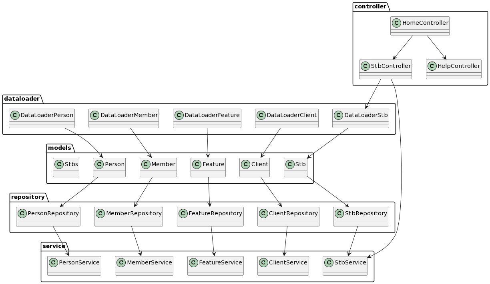

# API REST STB23

Ceci est une API REST pour gérer les STB (Spécifications Techniques de Besoin) au format XML.

## Prérequis

Avant de commencer, assurez-vous d'avoir installé les éléments suivants :

- Java Development Kit (JDK) 17
- Eclipse (Maven intégré)
- PostgreSQL (base de données)

## Synthèse en diagramme



## Configuration du projet

1. Clonez le dépôt GitHub STB23 dans votre répertoire local :

```
git clone <url_du_dépôt>
```

2. Importez le projet dans votre IDE Eclipse.

3. Configurez la connexion à la base de données PostgreSQL :

Ouvrez le fichier `src/main/resources/application.properties`.

Modifiez les propriétés suivantes en fonction de votre environnement :

```
spring.datasource.url=jdbc:postgresql://${POSTGRESQL_ADDON_HOST}:${POSTGRESQL_ADDON_PORT}/${POSTGRESQL_ADDON_DB}
spring.datasource.username=${POSTGRESQL_ADDON_USER}
spring.datasource.password=${POSTGRESQL_ADDON_PASSWORD}
```

`POSTGRESQL_ADDON_HOST`: Cette variable représente l'hôte (adresse IP ou nom d'hôte) où se trouve la base de données PostgreSQL.

`POSTGRESQL_ADDON_PORT`: Cette variable représente le port sur lequel la base de données PostgreSQL est accessible.

`POSTGRESQL_ADDON_DB`: Cette variable représente le nom de la base de données PostgreSQL à laquelle l'application se connectera.

`POSTGRESQL_ADDON_USER`: Cette variable représente le nom d'utilisateur de la base de données PostgreSQL.

`POSTGRESQL_ADDON_PASSWORD`: Cette variable représente le mot de passe de la base de données PostgreSQL.

Maintenant, il ne vous reste plus qu'à adapter ces variables à votre configuration de votre base de données.

Voici le `application.properties` pour le développement et test en local :

```
# ===============================
# SERVER
# ===============================
server.port=8080

# ===============================
# DEBUG
# ===============================
logging.level.org.springframework.web=DEBUG
server.error.include-stacktrace=ALWAYS

# ===============================
# DATABASE
# ===============================
spring.datasource.driver-class-name=org.postgresql.Driver
spring.datasource.url=jdbc:postgresql://localhost:5432/stb23
spring.datasource.username=stb23
spring.datasource.password=stb23
# Fix Postgres JPA Error:
# Method org.postgresql.jdbc.PgConnection.createClob() is not yet implemented.
spring.jpa.properties.hibernate.dialect=org.hibernate.dialect.PostgreSQLDialect
spring.jpa.properties.hibernate.temp.use_jdbc_metadata_defaults=false
spring.jpa.hibernate.ddl-auto=create
spring.jpa.defer-datasource-initialization=true

# CORS
allowed.origins=http://localhost:5173,https://localhost:5173
```

4. Configuration le CROSS ORIGIN :

```
allowed.origins=http://localhost:5173,https://localhost:5173
```

Le client étant en local et un serveur VITE JS sur le port 5173, il faut inclure dans cette variable,
les urls qui sont autorisés à échanger avec l'API Rest.

Pour la phase de production, ces valeurs sont aussi à changer, par exemple, si le client est déployé
sur clevercloud et que le nom de domaine du client est `https://app-03f26cc3-7f6b-4531-bbf6-dd86db89c40c.cleverapps.io` il faut l'ajouter comme sur l'exemple suivant :

Localhost(http,https) + clevercloud nom domaine client :

```
allowed.origins=http://localhost:5173,https://localhost:5173,https://app-03f26cc3-7f6b-4531-bbf6-dd86db89c40c.cleverapps.io
```

# Exécution de l'API en local

- Démarrez votre serveur PostgreSQL.
- Démarrez l'API REST STB23 en exécutant la classe principale `Stb23Application.java ` depuis l'IDE Eclipse
  avec `Run as > Spring Boot Application`

# Production

Pour déployer une api REST Spring Boot, (Java et Maven), il faut créer à la racine du projet un répertoire `clevercloud` et y ajouter un fichier `maven.json`
`/clevercloud/maven.json`

```
{
	"build": {
		"type": "maven",
		"goal": "package"
	},
	"deploy": {
		"goal": "spring-boot:run"
	}
}
```

Problèmes rencontrées lors du déploiement :

- Erreur avec maven-wrapper.properties : ajouter le suivi du répertoire .mvn au dépôt git
- Déploiement sous Windows : pas de droit d'accès à mvnw => git update-index --chmod=+x mvwn
